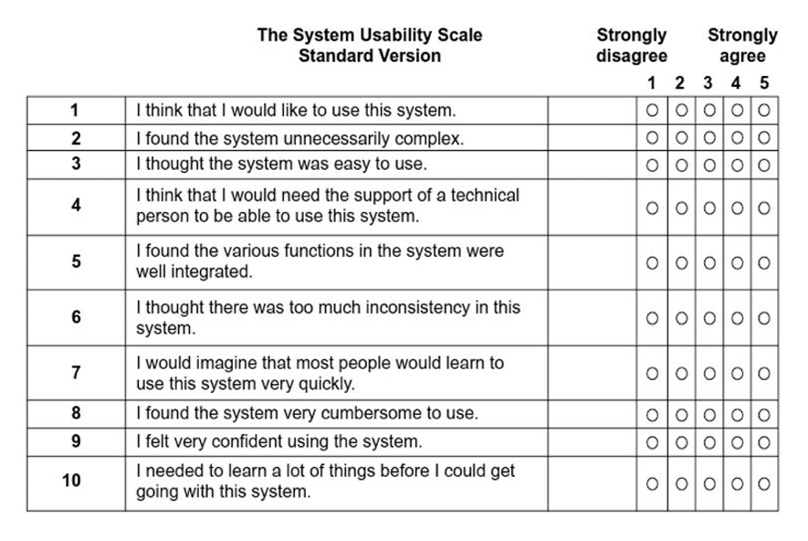

## **1. Introduction & Objectives**

## **2. Consent**

* Participant agrees that:

  * Data may be collected (time, errors, answers).
  * Testing is anonymous.
  * They may stop at any time.

## **3. Pre-Test Questionnaire**

* Basic demographic information: age, gender, experience.

## **4. Test Setup**

* Location: classroom
* Devices: laptop / web camera
* Initial state: system at home screen

## **5. Tasks**

1. Task 1: “Play a Kick and Snare pattern”
2. Task 2: “Play a single unmodified Tone (w/ right hand)”
3. Task 3: “Play a modified tone (right + left 2+ fingers)”
4. Task 4: “Play a chord  (right hand 2+ fingers)”
5. Task 5: “Play a modified chord (right 2+ fingers + left 2+ fingers)”

## **6. Data Collection**

* **Objective data:** time to achieve, number of mistakes
* **Subjective data:** opinions, perceived difficulty

Through:

* **Direct observation** while user performs tasks.

## **7. Post-Task Questionnaire**

* “How easy was this task?”
* “What was confusing?”
* "Was the system comprehensive?"

**SUS (System Usability Scale)**

## **9. Interview / Debrief**

* “What did you like the most?”
* “What frustrated you?”
* “If you could change one thing, what would it be?”

---

# **Pre-Test Questionnaire**

1. Age: ___
2. Gender: ___
3. Experience with similar systems (1–5): ___
4. How often do you use similar apps?

   * Never / Rarely / Sometimes / Often / Daily

---

# **Simple Post-Task Questionnaire**

**For each task:**

1. How easy or difficult was the task? (1 = very difficult, 7 = very easy)
2. What part was confusing or slow?
3. Any suggestion for improvement?

# **Simple Post-Test Questionnaire**

Use the 10 standard SUS questions (Strongly disagree → Strongly agree):

# **Interview Script**

1. What did you like the most about the system?
2. What did you dislike the most?
3. Would you use this system again? Why or why not?
4. Any final suggestions?

